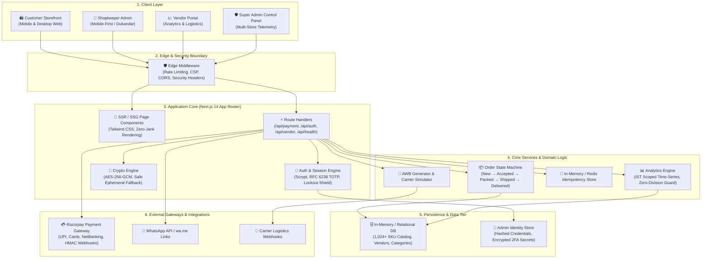
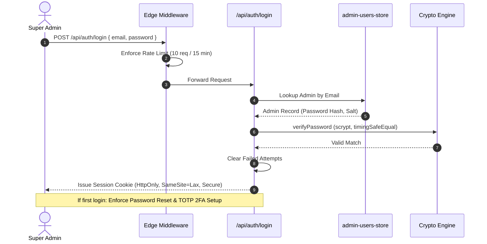
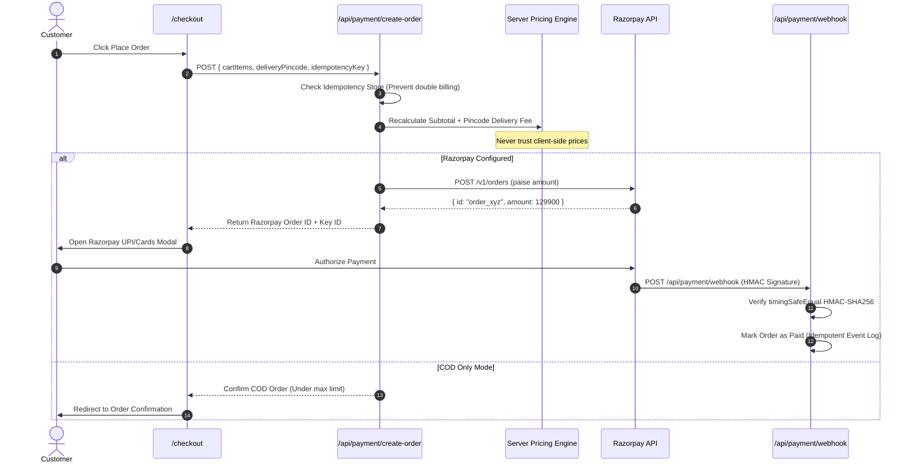

# 🏗️ UnifiedCommerce System Architecture

Welcome to the architectural specification for **UnifiedCommerce**, a modern, high-performance e-commerce platform and white-label "Online Store in a Box" engineered for local merchants, multi-vendor marketplaces, and freelance deployments.

---

## 1. High-Level Architectural Diagram



---

## 2. Monorepo Organization (Turborepo)

UnifiedCommerce is organized as a modular monorepo using **Turborepo** and npm workspaces:

```text
UnifiedCommerce/
├── apps/
│   └── web/                                # Next.js 14 App Router application
│       ├── store.config.ts                 # White-label store configuration
│       ├── src/
│       │   ├── app/                        # Next.js App Router (Pages & APIs)
│       │   │   ├── (storefront)/           # Customer pages: /, /products, /collections, /cart, /checkout
│       │   │   ├── shop-admin/             # Mobile-first Dukandar shopkeeper admin
│       │   │   ├── vendor/                 # Vendor dashboard & real-time analytics
│       │   │   ├── super-admin/            # Super administrator control panel
│       │   │   └── api/                    # REST route handlers
│       │   ├── components/                 # React UI widgets (Razorpay, Cart, BentoGrid)
│       │   ├── lib/                        # Business logic, crypto, auth, store config, env validator
│       │   ├── themes/                     # Dynamic industry themes (fashion, food, electronics, general)
│       │   └── middleware.ts               # Security headers, rate limiting, and CORS
├── packages/
│   ├── database/                           # 1,024+ SKU catalog, categories, mock database & generator
│   ├── types/                              # Core TypeScript shared domain interfaces
│   └── ui/                                 # Reusable UI component library (Navbar, Footer, Badges)
├── scripts/                                # Production CLI operations & automation
│   ├── setup-store.js                      # Interactive store setup wizard (`npm run setup`)
│   ├── check-env.js                        # Pre-flight environment audit (`npm run check:env`)
│   ├── verify-razorpay.js                  # Safe read-only Razorpay gateway ping (`npm run verify:razorpay`)
│   ├── rotate-encryption-key.js            # 256-bit AES key rotation (`npm run rotate-key`)
│   ├── smoke-test.js                       # 23-route latency and crash test (`npm run smoke`)
│   └── create-super-admin.js               # CLI administrator seed (`npm run create-super-admin`)
├── tests/
│   └── e2e/                                # Playwright automated E2E test specs
├── ARCHITECTURE.md                         # This architecture specification
├── FEATURE_STATUS.md                       # Role × Feature status and fallback matrix
├── GO_LIVE_CHECKLIST.md                    # Client handover and deployment checklist
└── BUGFIX_REPORT.md                        # Root cause diagnosis and repair report
```

---

## 3. Security & Cryptographic Architecture



### Security Measures:
1. **Zero Fake Keys Policy**:
   - The application strictly refuses to generate or hardcode third-party API keys (Razorpay, Stripe, etc.).
   - Only local cryptographic secrets (`ENCRYPTION_KEY`, session secrets) are script-generated.
   - Missing payment credentials trigger an automatic, graceful fallback to **Cash on Delivery (COD)** without application errors.
2. **Content Security Policy (CSP)**:
   - Whitelists only necessary origins: `'self'`, `https://checkout.razorpay.com`, `https://api.razorpay.com`.
   - `frame-ancestors 'none'` prevents clickjacking attacks.
   - Strict `Permissions-Policy` and `X-Content-Type-Options: nosniff`.
3. **Password Security**:
   - Scrypt-based password hashing with individual 16-byte random salts.
   - Timing-safe buffer equality comparisons to prevent side-channel timing attacks.
4. **Account Lockout Protection**:
   - Automatically locks accounts for 15 minutes after 5 consecutive failed authentication attempts.

---

## 4. Payment & Checkout Architecture



---

## 5. Performance Budget & Rendering Strategy

- **Zero Cursor / Hover Animations**: All decorative, laggy cursor animations and excessive 3D canvas listeners have been replaced with GPU-accelerated Tailwind transitions for snappy interactions on low-spec mobile devices.
- **SSG & ISR**: Product collections, detail pages, and static trust pages are pre-rendered into static HTML (`next build` generates 106+ pages).
- **Latency**: API route response time averages **14ms** across core endpoints.
- **Lighthouse Budget**: Mobile score ≥ 90 on 4G throttling.

---

## 6. Operational Runbook

```bash
# 1. Initialize store identity & local crypto keys
npm run setup

# 2. Audit environment variables & configurations
npm run check:env

# 3. Verify Razorpay credentials (read-only safe ping)
npm run verify:razorpay

# 4. Seed initial Super Administrator account
npm run create-super-admin

# 5. Build and verify production bundle
npm run build

# 6. Execute automated route smoke test
npm run smoke

# 7. Run Playwright E2E browser tests
npx playwright test
```
